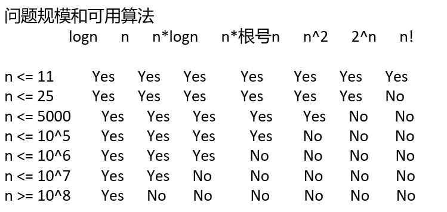

## 根据数据量猜解法的技巧

C/C++运行时间1s，java/python/go等其他语言运行时间1s~2s，
对应的常数指令操作量是 10^7 ~ 10^8，不管什么测试平台，不管什么cpu，都是这个数量级
所以可以根据这个基本事实，来猜测自己设计的算法最终有没有可能在规定时间内通过

运用 根据数据量猜解法技巧 的必要条件：
1，题目要给定各个入参的范围最大值，正式笔试、比赛的题目一定都会给，面试中要和面试官确认
2，对于自己设计的算法，时间复杂度要有准确的估计

可以提前获知自己的方法能不能通过，也可以对题目的分析有引导作用



现在有一个打怪类型的游戏，这个游戏是这样的，你有n个技能
每一个技能会有一个伤害，
同时若怪物小于等于一定的血量，则该技能可能造成双倍伤害
每一个技能最多只能释放一次，已知怪物有m点血量
现在想问你最少用几个技能能消灭掉他(血量小于等于0)
技能的数量是n，怪物的血量是m
i号技能的伤害是x[i]，i号技能触发双倍伤害的血量最小值是y[i]
1 <= n <= 10
1 <= m、x[i]、y[i] <= 10^6
[测试链接](https://www.nowcoder.com/practice/d88ef50f8dab4850be8cd4b95514bbbd)

```c++
#include <climits>
#include <iostream>
#include <sstream>
#include <vector>
#include <algorithm>
using namespace std;


// int f(vector<int>& kill, vector<int>& blood, int idx, int enemy) {
//     if (enemy <= 0) {
//         return idx;
//     }

//     if (idx == kill.size()) {
//         return INT_MAX;
//     }

//     int ans = INT_MAX;
//     for (int j = idx; j < kill.size(); j++) {
//         swap(kill[idx], kill[j]);
//         swap(blood[idx], blood[j]);

//         ans = min(ans, f(kill, blood, idx + 1, enemy - (enemy <= blood[idx] ? 2 * kill[idx] : kill[idx])));

//         swap(kill[idx], kill[j]);
//         swap(blood[idx], blood[j]);
//     }

//     return ans;
// }

int f1(vector<int>& kill, vector<int>& blood, int i, int r) {
    if(r <= 0) return i;
    if(i == kill.size()) return INT_MAX;

    int ans = INT_MAX;
    for(int j = 0; j < kill.size(); j++) {
        if(kill[j] == -1 && blood[j] == -1) {
            continue;
        }

        int tmp1 = kill[j], tmp2 = blood[j];
        kill[j] = -1;
        blood[j] = -1;

        ans = min(ans, f1(kill, blood, i + 1, r - (r > tmp2 ? tmp1 : 2 * tmp1)));

        kill[j] = tmp1;
        blood[j] = tmp2;
    }

    return ans;
}


int main() {
    stringstream ss;
    ss << cin.rdbuf();
    int T = 0;
    ss >> T;
    for (int i = 0, n = 0, m = 0, ans = -1; i < T; i++) {
        ss >> n >> m;
        vector<int> kill(n), blood(n);
        for (int j = 0; j < n; j++) {
            ss >> kill[j] >> blood[j];
        }

        ans = f1(kill, blood, 0, m);
        cout << (ans == INT_MAX ? -1 : ans) << endl;

    }
}
```

超级回文数(java版)
如果一个正整数自身是回文数，而且它也是一个回文数的平方，那么我们称这个数为超级回文数。
现在，给定两个正整数 L 和 R （以字符串形式表示），
返回包含在范围 [L, R] 中的超级回文数的数目。
1 <= len(L) <= 18
1 <= len(R) <= 18
L 和 R 是表示 [1, 10^18) 范围的整数的字符串
[测试链接](https://leetcode.cn/problems/super-palindromes/)

```c++
class Solution {
public:
    int superpalindromesInRange(string left, string right) {
        long long l = stoll(left);
        long long r = stoll(right);

        long long limit = static_cast<long long>(sqrt(r));
        long long num = 0;
        long long val = 1;
        int cnt = 0;

        do {
            num = even(val);

            if (num <= limit && safeSquare(num) && check(num * num, l, r)) {
                cnt++;
            }

            num = odd(val);

            if (num <= limit && safeSquare(num) && check(num * num, l, r)) {
                cnt++;
            }

            val++;
        } while (num < limit);

        return cnt;
    }

   bool safeSquare(long long val) {
       return val <= static_cast<long long>(sqrt(numeric_limits<long long>::max()));
   }

    long long even(long long val) {
        long long ans = val;

        while (val != 0) {
            ans = ans * 10 + val % 10;
            val /= 10;
        }

        return ans;
    }

    long long odd(long long val) {
        long long ans = val;
        val /= 10;

        while (val != 0) {
            ans = ans * 10 + val % 10;
            val /= 10;
        }

        return ans;
    }

    bool check(long long val, long long l, long long r) {
        return val >= l && val <= r && is(val);
    }

    bool is(long long val) {
        long long offset = 1;
        while (val / offset >= 10) {
            offset *= 10;
        }

        while (val != 0) {
            if ((val / offset) != (val % 10)) {
                return false;
            }

            val = (val % offset) / 10;
            offset /= 100;
        }

        return true;
    }
};
```
