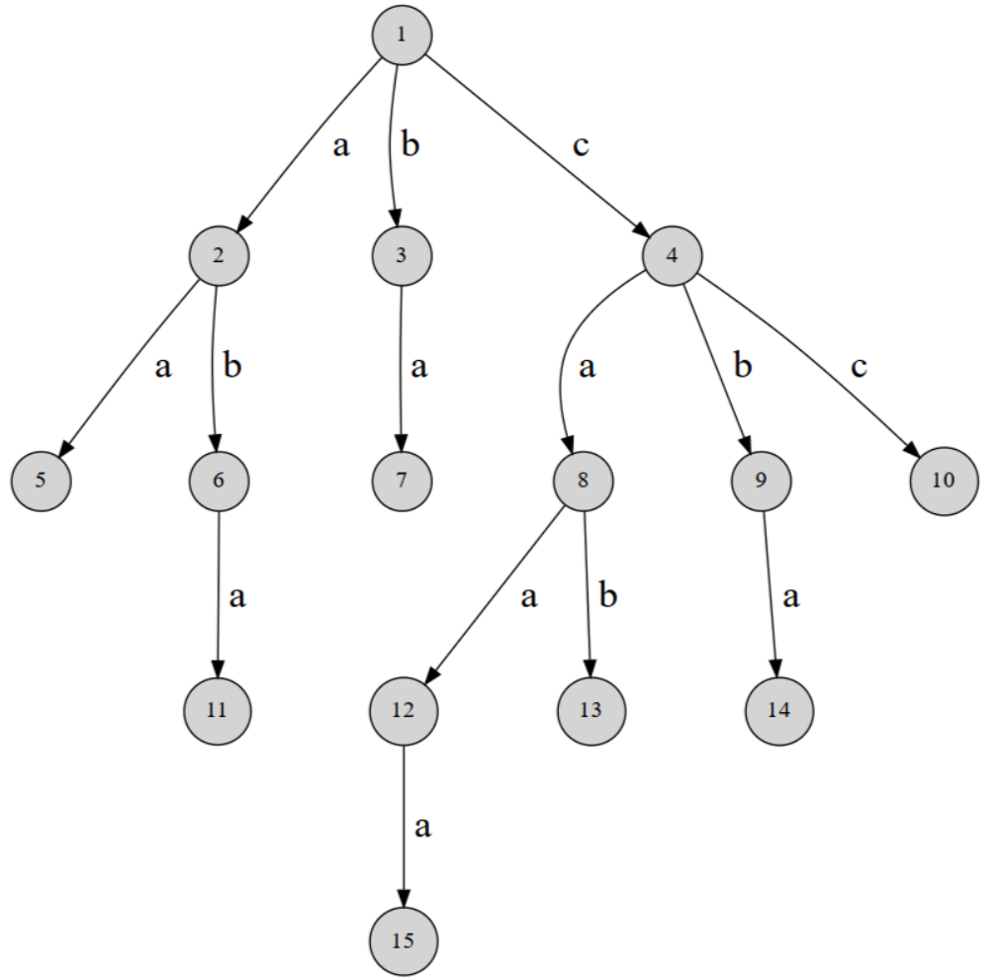

## 字典树

字典树（TrieTree），是一种树形结构，典型应用是用于统计，排序和保存大量的字符串（但不仅限于字符串,如01字典树）。主要思想是利用字符串的公共前缀来节约存储空间。



```c++
#include <sstream>
#include <string>
#include <iostream>
#include <array>
using namespace std;

constexpr long long MAX = 10000005;
array<array<int, 26>, MAX> trie = {0};
array<int, MAX> pass = {0};
array<int, MAX> exist = {0};

int cnt = 0;


void insert(string word) {
    int p = 0;
    for (int i = 0, n = word.size(); i < n; i++) {
        int c = word[i] - 'a';
        if (!trie[p][c]) trie[p][c] = ++cnt;
        p = trie[p][c];

        pass[p]++;
    }
    exist[p]++;
}

int search(string word) {
    int p = 0;
    for (int i = 0, n = word.size(); i < n; i++) {
        int c = word[i] - 'a';
        if (!trie[p][c]) return false;

        p = trie[p][c];
    }

    return exist[p];
}

int prefix_number(string prefix) {
    int p = 0;
    for (int i = 0, n = prefix.size(); i < n; i++) {
        int c = prefix[i] - 'a';
        if (!trie[p][c]) return 0;

        p = trie[p][c];
    }

    return pass[p];
}

void delete_word(string word) {
    if (search(word) == 0) return;

    int p = 0;
    for (int i = 0, n = word.size(); i < n; i++) {
        int c = word[i] - 'a';

        p = trie[p][c];
        pass[p]--;
    }

    exist[p]--;
}

int main() {
    stringstream ss;
    ss << cin.rdbuf();

    int n = 0;
    ss >> n;

    int op = -1;
    string word = "";

    for(int i = 0; i < n; i++) {
        ss >> op >> word;
        switch(op) {
            case 1:
                insert(word);
                break;
            case 2:
                delete_word(word);
                break;

            case 3:
                cout << (search(word) > 0 ? "YES" : "NO") << endl;
                break;

            case 4:
                cout << prefix_number(word) << endl;
                break;
            default:
                break;
        }
    }

    return 0;
}
```

## TODO

## 相关题目

牛牛和他的朋友们约定了一套接头密匙系统，用于确认彼此身份
密匙由一组数字序列表示，两个密匙被认为是一致的，如果满足以下条件：
密匙 b 的长度不超过密匙 a 的长度。
对于任意 0 <= i < length(b)，有b[i+1] - b[i] == a[i+1] - a[i]
现在给定了m个密匙 b 的数组，以及n个密匙 a 的数组
请你返回一个长度为 m 的结果数组 ans，表示每个密匙b都有多少一致的密匙
数组 a 和数组 b 中的元素个数均不超过 10^5
1 <= m, n <= 1000
[测试链接](https://www.nowcoder.com/practice/c552d3b4dfda49ccb883a6371d9a6932)

```c++

```
