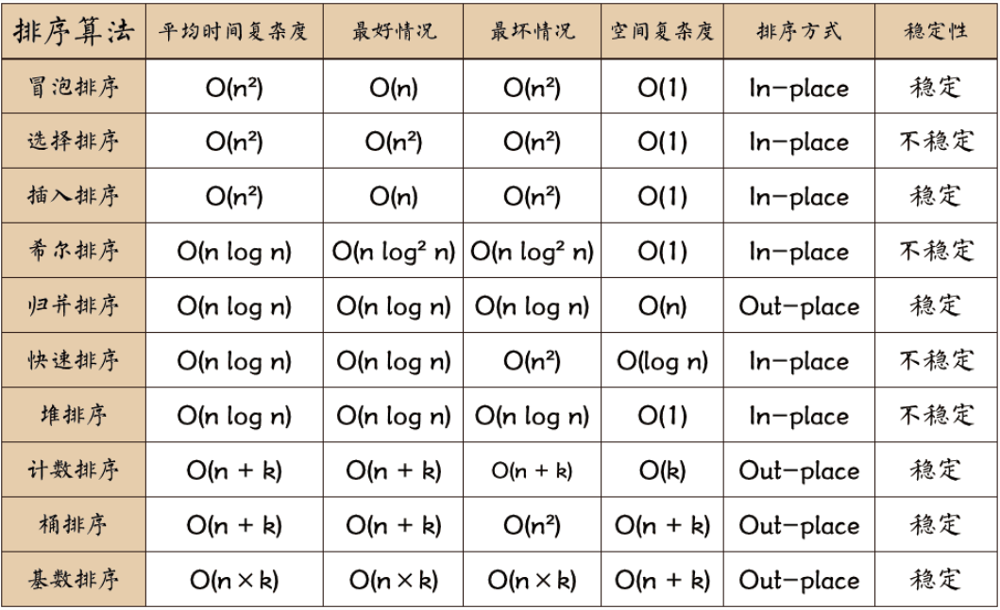

## 排序算法

#### 选择排序

```c++
// 数组 0 ~ size-1，遍历最大值，记录最大值索引 k，与索引 size-1 交换
void select_sort(vector<int>& arr){
    int n = arr.size() - 1;


    for(int i = n; i > 0; i--) {
        int max_val = arr[0];
        int max_val_index = 0;

        for(int j = 1; j <= i; j++) {
            if(arr[j] > max_val) {
                max_val = arr[j];
                max_val_index = j;
            }
        }

        swap(arr[i], arr[max_val_index]);
    }
}
```

#### 冒泡排序

```c++
// 数组 1 ~ size-1，与临近的左值比较，如果左值大，交换，反之不交换
// 也可以添加一个信息位 break_flag，如果内层循环全程不调用swap，就跳出外层循环，说明数组已经有序
void bubble_sort(vector<int>& arr) {
    int n = arr.size() - 1;

    for(int i = n; i > 0; i--) {
        for(int j = 1; j <= i; j++){
            if(arr[j] < arr[j - 1]) {
                swap(arr[j], arr[j - 1]);
            }
        }
    }
}
```

#### 插入排序

```c++
// 从索引1开始，往前遍历，当遍历到比索引1值小(索引位 k，k < 1)，把arr[1]插入arr[k]后面
// 就像玩斗地主，拿牌一样
void insertion_sort(vector<int>& arr) {
    int n = arr.size() - 1;

    for(int i = 1; i <= n; i++) {
        for(int j = i - 1; j >= 0; j--) {
            if(arr[j] > arr[j + 1]) {
                swap(arr[j], arr[j + 1]);
            }
        }
    }
}
```

#### 归并排序

**递归版本**

```c++
// 一个数组，分为左右两部分，递归实现左边有序，右边有序，然后合并左右两部分，整个数组有序
#define SIZE 10000

int temp[SIZE] = {0};

void merge(int* arr, int l, int mid, int r) {
    int n = r - l + 1, i = 0;
    int l_1 = l, l_2 = mid + 1;
    while(l_1 <= mid && l_2 <= r) {
        if(arr[l_1] < arr[l_2]) {
            temp[i] = arr[l_1++];
        } else {
            temp[i] = arr[l_2++];
        }

        i++;
    }

    while(l_1 <= mid) {
        temp[i++] = arr[l_1++];
    }

    while(l_2 <= r) {
        temp[i++] = arr[l_2++];
    }

    for(int j = 0; j < n; j++) {
        arr[j + l] = temp[j];
    }
}

void merge_sort(int* arr, int l, int r) {
    if(l >= r) return;
    int mid = l + ((r - l) >> 1);

    merge_sort(arr, l, mid);
    merge_sort(arr, mid + 1, r);

    merge(arr, l, mid, r);
}
```

**非递归版本**

```c++
#define SIZE 10000

int temp[SIZE] = {0};

void merge_sort(int* arr, int n) {
    for(int l, m, r, step = 1; step < n; step <<= 1) {
        l = 0;
        while (l < n) {
            m = l + step - 1;
            if (m + 1 >= n) {
                break;
            }
            r = (l + (step << 1) - 1) < (n - 1) ? (l + (step << 1) - 1) : (n - 1);
            merge(arr, l, m, r);
            l = r + 1;
        }
    }
}
```

**快速排序**

```c++
// 标准快速排序 从小到大
void quick_sort(int* arr, int start, int end){
    if(start >= end) return;

    int val = arr[end];
    int l = start, r = end;

    while(l < r) {
        while(l < r && arr[l] <= val) {
            l++;
        }

        arr[r] = arr[l];

        while(l < r && arr[r] > val) {
            r--;
        }

        arr[l] = arr[r];
    }

    arr[l] = val;

    quick_sort(arr, start, l - 1);
    quick_sort(arr, l + 1, end);
}
```

**随机快速排序**

```c++
random_device rd;
mt19937 engine(rd());

void random_quick_sort(int* arr, int start, int end){
    if(start >= end) return;

    uniform_int_distribution<int> index(start, end);

    int idx = index(engine);
    int temp = arr[end];
    arr[end] = arr[idx];
    arr[idx] = temp;

    int val = arr[end];
    int l = start, r = end;

    while(l < r) {
        while(l < r && arr[l] <= val) {
            l++;
        }

        arr[r] = arr[l];

        while(l < r && arr[r] > val) {
            r--;
        }

        arr[l] = arr[r];
    }

    arr[l] = val;

    random_quick_sort(arr, start, l - 1);
    random_quick_sort(arr, l + 1, end);
}
```

**荷兰国旗问题**

```c++
// 左边区域小于x，中间区域等于x，右边区域大于x

void swap(int* a, int* b) {
    if(*a == *b) return;

    *a = *a ^ *b;
    *b = *a ^ *b;
    *a = *a ^ *b;
}

void split_section(int* arr, int start, int end) {
    if(start == end) return;

    int val = arr[end];
    int l = start, r = end;
    int i = l;

    while(i <= r) {
        if(arr[i] < val) {
            swap(arr + l, arr + i);
            l++;
            i++;
        } else if(arr[i] > val) {
            swap(arr + i, arr + r);
            r--;
        } else {
            i++;
        }
    }
}
```

**无序数组中第K大的元素**
测试链接 : [无序数组中第K大的元素](https://leetcode.cn/problems/kth-largest-element-in-an-array/)

```c++
random_device rd;
mt19937 engine(rd());

void split_section(vector<int>& arr, int start, int end, int k) {
    if(start > end) return -1;

    uniform_int_distribution<int> index(start, end);

    int idx = index(engine);
    int temp = arr[end];
    arr[end] = arr[idx];
    arr[idx] = temp;

    int val = arr[end];
    int l = start, r = end;
    int i = l;

    while(i <= r) {
        if(arr[i] < val) {
            swap(arr + l, arr + i);
            l++;
            i++;
        } else if(arr[i] > val) {
            swap(arr + i, arr + r);
            r--;
        } else {
            i++;
        }
    }

    if(l <= k && k <= r) {
        return val;
    }

    if(k < l) {
        return split_section(arr, start, l - 1, k);
    }

    return split_section(arr, r + 1, end, k);
}


int find_k_largest(vector<int>& nums, int k){
    return split_section(arr, 0, nums.size() - 1, nums.size() - k);
}
```

**堆排序**

```c++
void swap(int* a, int* b) {
    int temp = *a;
    *a = *b;
    *b = temp;
}

void heap_up(int* arr) {
    int child = arr[0], parent = child / 2;

    while(parent > 0 && arr[child] < arr[parent]) {
        swap(arr + child, arr + parent);

        child = parent;
        parent = child / 2;
    }
}

void heap_push(int* arr, int val) {
    arr[++arr[0]] = val;

    heap_up(arr);
}

int* build_heap(int* arr, int n) {
    int* heap = (int*)malloc(sizeof(int) * (n + 1));
    heap[0] = 0;

    for(int i = 0; i < n; i++) {
        heap_push(heap, arr[i]);
    }

    return heap;
}

void heap_down(int* arr) {
    int parent = 1;
    int child = parent * 2 <= arr[0] ? parent * 2 + 1 <= arr[0] ? arr[parent * 2] < arr[parent * 2 + 1] ? parent * 2 : parent * 2 + 1 : parent * 2 : arr[0] + 1;
    while(child <= arr[0] && arr[parent] > arr[child]) {
        swap(arr + parent, arr + child);

        parent = child;
        child = parent * 2 <= arr[0] ? parent * 2 + 1 <= arr[0] ? arr[parent * 2] < arr[parent * 2 + 1] ? parent * 2 : parent * 2 + 1 : parent * 2 : arr[0] + 1;
    }
}

int heap_pop(int* arr) {
    if(arr[0] == 0) return INT_MIN;

    int ans = arr[1];

    swap(arr + 1, arr + arr[0]);
    arr[0]--;

    heap_down(arr);

    return ans;
}

void heap_sort(int* arr, int n) {

    int* heap = build_heap(arr, n);

    for(int i = 0; i < n; i++) {
        arr[i] = heap_pop(heap);
    }

    free(heap);
}
```

**计数排序**
使用在数据范围较小的数组中，通过临时数组索引代表数组元素，
临时数组值为数组元素出现次数，最后遍历临时数组，填充数组进行排序

**基数排序**

```c++
// 必须保证nums数组中元素为正数
vector<int> based_sort(vector<int>& nums) {
    int max_val = *max_element(nums.begin(), nums.end());

    vector<queue<int>> base(10);

    int n = 0;
    for(int val = max_val; val > 0; val /= 10) {
        n++;
    }

    int index = -1;
    for(int i = 0; i < n; i++) {
        for(int& val : nums) {
            index = val / (int)pow(10, i) % 10;
            base[index].push(val);
        }

        int j = 0;
        for(queue<int> que : base) {
            while(!que.empty()) {
                nums[j++] = que.front();
                que.pop();
            }
        }
    }

    return nums;
}

// 把数组整体变为正数，使用long防止溢出
vector<int> sortArray(vector<int>& nums) {
    long min_val = *min_element(nums.begin(), nums.end());
    long max_val = *max_element(nums.begin(), nums.end());
    max_val -= min_val;

    vector<long> arr;

    for(long val : nums) {
        arr.push_back(val - min_val);
    }

    int n = 0;
    for (long val = max_val; val > 0; val /= 10) {
        n++;
    }

    vector<queue<long>> base(10);
    int index = -1;
    long div = 1;
    for (int i = 0; i < n; i++, div *= 10) {
        for (long& val : arr) {
            index = val / div % 10;
            base[index].push(val);
        }

        int j = 0;
        for (queue<long>& que : base) {
            while (!que.empty()) {
                arr[j++] = que.front();
                que.pop();
            }
        }
    }

    for(int i = 0; i < nums.size(); i++) {
        ums[i] = arr[i] + min_val;
    }

    return nums;
}
```

## 排序总结


