## 记录自己怎么从零开始搭建一个简单的博客。

使用 hexo 框架，文件托管在 Github，Netlify 部署网站，国内访问使用 Cloudflare 进行 CDN 加速。整个过程不需要服务器，备案，只需要一个域名。

下面介绍博客搭建的过程，工具及其用法。

## 使用的工具和环境

在 VMware Workstation Pro 虚拟机上进行博客搭建，操作系统是 Ubuntu 22.04.5 LTS。怎么使用虚拟机、安装操作系统网络上有很多了，不多赘述。

## hexo 框架

### 介绍

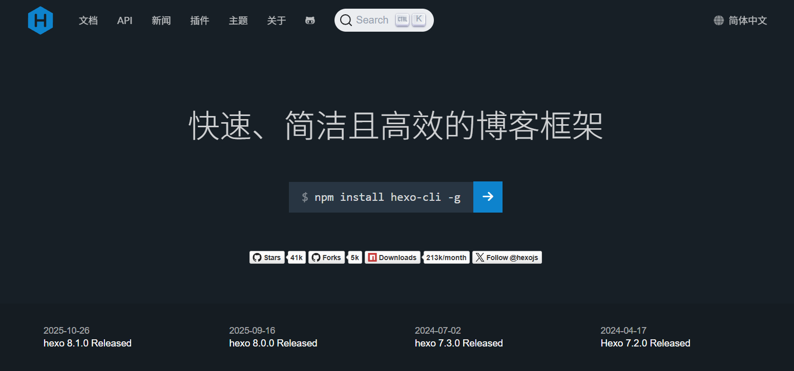
hexo 是基于 Nodejs 的静态网页生成框架，它支持 Markdown 语法，编辑简单，能够快速生成 html 文件，部署简单，兼容性强。

### 环境配置

使用 hexo 首先需要 Nodejs 环境，搜索官网自行选装版本(LTS)进行下载安装。

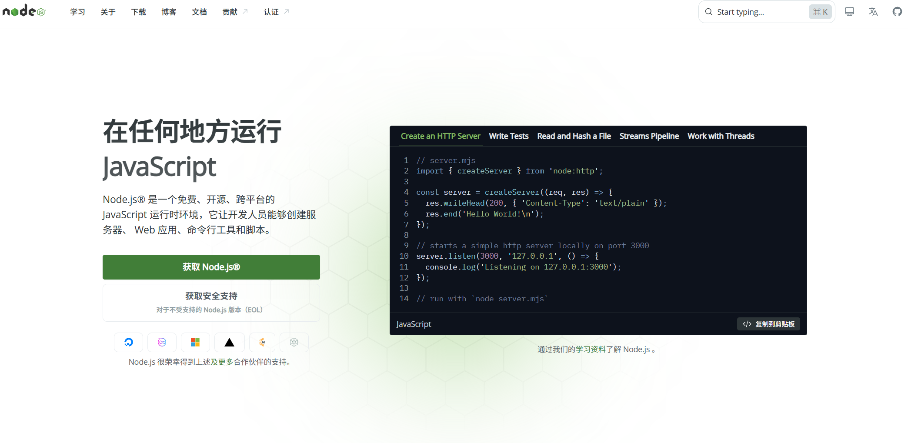

```bash
# Download and install nvm:
curl -o- https://raw.githubusercontent.com/nvm-sh/nvm/v0.40.4/install.sh | bash

# in lieu of restarting the shell
\. "$HOME/.nvm/nvm.sh"

# Download and install Node.js:
nvm install 22
```

> 注: 使用 Ubuntu 自带的 apt 或 apt-get 包管理器，会导致系统无法拉起 GNOME 桌面，建议使用官方下载。

输入以下命令，验证是否安装成功，输出正确版本信息，说明环境配置成功。

```bash
# Verify the Node.js version:
node -v # Should print "v22.22.2".

# Verify npm version:
npm -v # Should print "10.9.7".
```

由于 npm 使用官方源下载比较慢，输入以下命令，设置国内源。

```bash
npm config get registry # 查看源的设置

npm config set registry https://registry.npmmirror.com # 设置为国内源

npm config get registry # 查看是否设置成功
```

### 博客生成

#### 安装

使用 npm 包管理器，安装 hexo，输入一下命令：

```bash
npm install hexo-cli -g # 全局安装hexo命令行工具
```

> 其中 -g 参数表示全局安装，没有这个参数就只在当前目录下安装，建议全局安装。

### 初始化

```bash
hexo init "博客目录名" # 目录名称不含空格的时候双引号可以省略
```

输出如下：

```bash
INFO  Cloning hexo-starter https://github.com/hexojs/hexo-starter.git
INFO  Install dependencies
# 一些可能的中间信息
INFO  Start blogging with hexo!
```

进入博客目录，安装所需依赖：

```bash
cd "博客目录名"
npm install # 所安装依赖可以在package.json文件的dependencies字段中找到
```

### 博客目录组成

查看目录结构：

```bash
tree -L 1
```

结果如下：

```bash
.
├── _config.landscape.yml
├── _config.yml
├── db.json
├── node_modules
├── package.json
├── package-lock.json
├── public
├── scaffolds
├── source
└── themes
```

简单说明一下一些文件含义：

- \_config.yml 为全局配置文件，在这里可以设置网站的很多信息，比如说网站名称，副标题，描述，作者，语言，主题等等。具体可参考官方文档：[https://hexo.io/zh-cn/docs/configuration](https://hexo.io/zh-cn/docs/configuration)
- source 里面的\_post 文件夹，存放网站的 markdown 文件，初始化之后，可以看到里面有一个 hello\-world.md 文件。同时也可以创建文件夹用来存放 md 文件所引用的图片
- themes 网站主题目录，用来存放主题。hexo 有很多主题支持，更多主题：[https://hexo.io/themes](https://hexo.io/themes)

### 博客添加新文章

```bash
hexo new post "test" # 会在 source/_posts/ 目录下生成文件 ‘test.md’，打开编辑
hexo generate        # 生成静态HTML文件到 /public 文件夹中
hexo server          # 本地运行server服务预览，打开 http://localhost:4000 即可预览你的博客
```

经过自己修改\_config.yml 中的标题，副标题字段，设置新主题之后，本地预览效果：

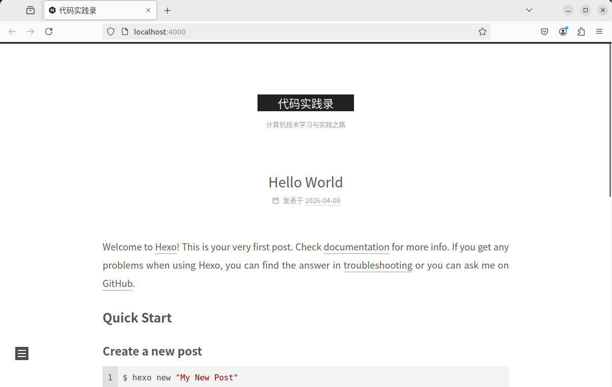

## Github 文件托管

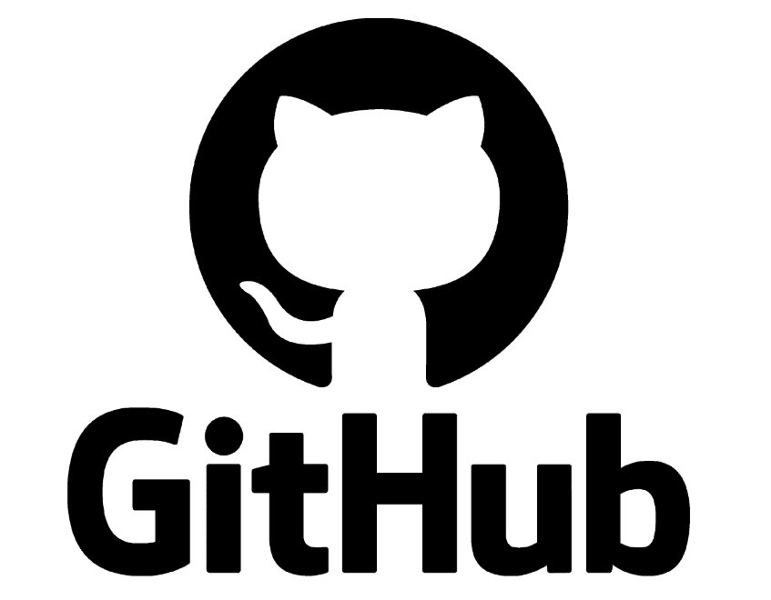

```bash
cd "博客目录"
git init
git add .
git commit -m "my blog first commit"
git remote add origin "远端github仓库地址"
git branch -M main
git push -u origin main
```

## Netlify 建站

### 介绍

Netlify 是国外免费的提供静态网站部署服务平台，能够将托管 GitHub，GitLab 等上的静态网站部署上线。

### 建站步骤

1. 首先注册并登录[Netlify](https://www.netlify.com/)
   - 需要科学上网，后续可使用 Cloudflare 进行国内访问加速
2. 新建站点
   - 注册账号登录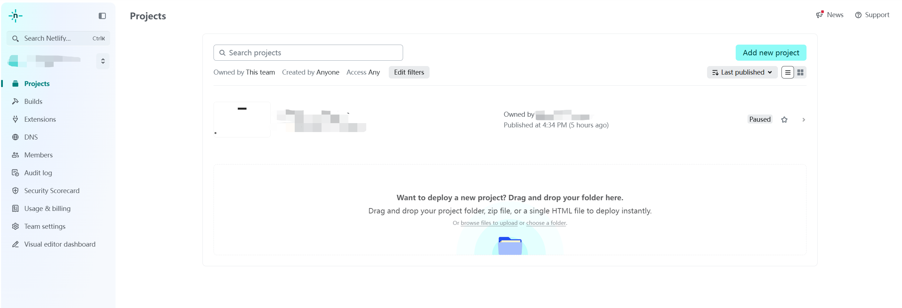
   - 新建项目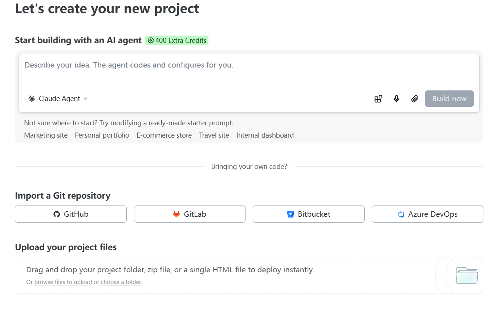
   - 选择你所需要上传的 github 仓库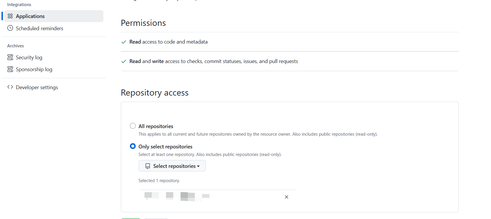
   - 配置部署命令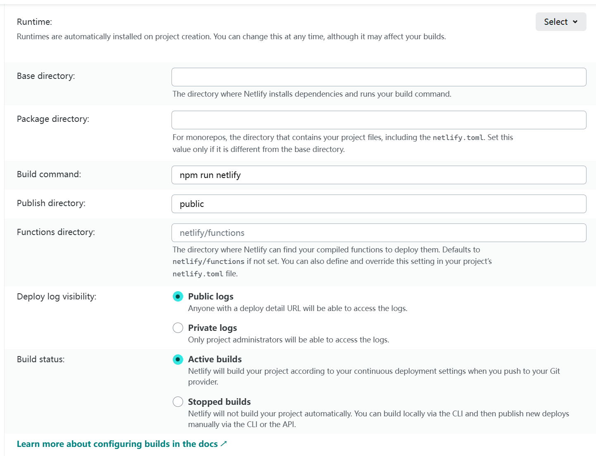
     > BaseDirectory 为空表示项目目录是仓库目录的根目录.
   - 构建完成后我们就能够看到一个 URL，打开网址就是我们的个人博客了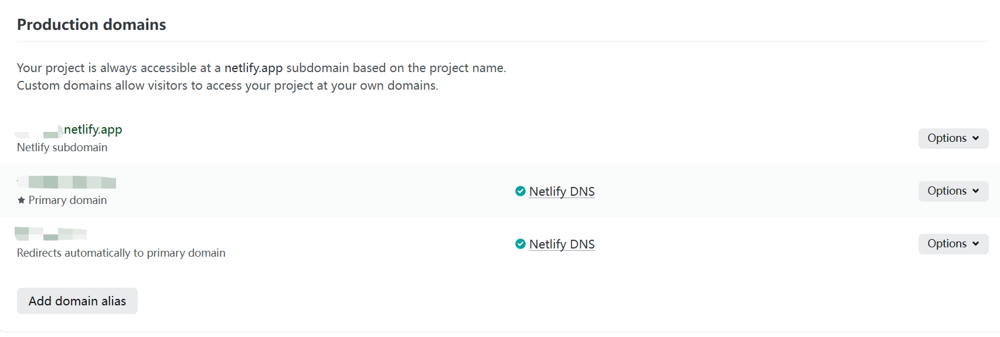

个人博客已经算是搭建完毕。下面需要解决的就是配置域名和访问慢的问题了。

### 配置域名

需要购买一个域名，我是在腾讯云上买的域名，然后把在 Netlify 上得到的域名(\*\*\*.netlify.app)进行如下设置：

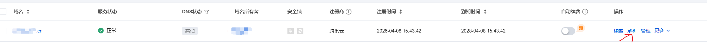

然后设置域名解析，类型为 CNAME，内容为 xxxxx.netlify.app，其中 xxxxx 为你自己设置的个性二级域名。

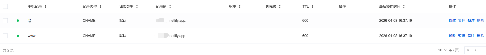

设置完毕之后需要等待一段时间，因为 DNS 服务器需要一段时间来进行同步。然后，我们还需要回到 netlify 中配置一下自己的用户域名，这样的话可以在国外获得 netlify 本身的 CDN 支持。


之后，可以通过自己配置的域名访问自己的个人博客，比如说我的博客地址是 [https://a2coder24.cn](https://a2coder24.cn) 。

## ClouldFlare 加速

### 介绍

Netlify 提供的 CDN 加速，可以使用但国内访问还是比较慢，Cloudflare 相对于国内的七牛云、阿里云等云服务商的 CDN 速度会慢一些，但是它有免费版本，而且域名不用备案。

### 国内加速步骤

1. 注册并登录[Cloudflare](https://dash.cloudflare.com/)
2. 添加站点
   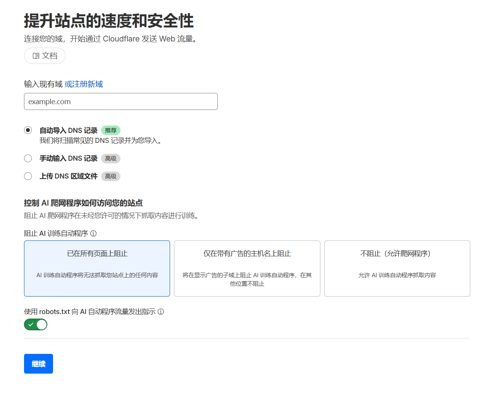
3. 添加 DNS 记录
   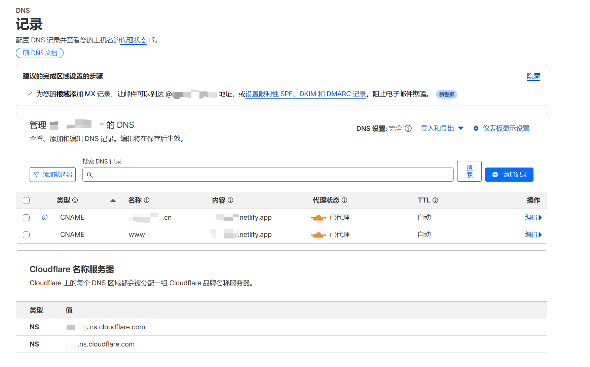
4. 将 3 中的 Cloudflare 名称服务器，添加到域名服务提供商
   - 以腾讯云为例：
     这是域名配置界面
     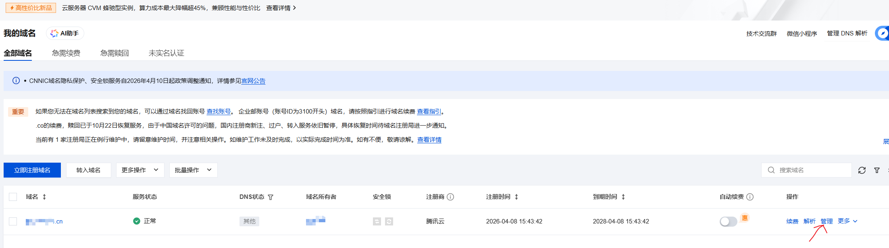
   - 将域名服务器从腾讯云的默认服务器改成 clouldflare 的服务器
     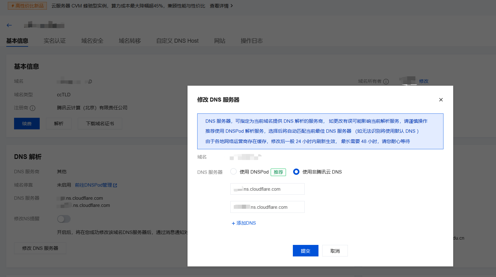
     > 配置完成之后，cloudflare 会邮件通知。

### 配置 https

1. 确认 DNS 解析
   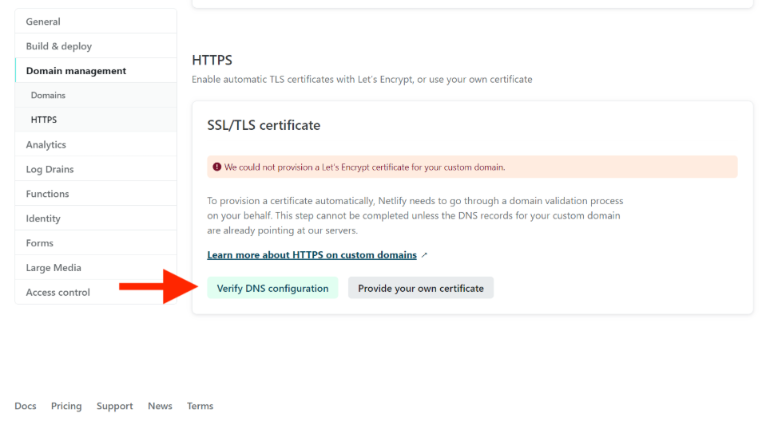
2. 它会自动安装证书，这是成功的截图
   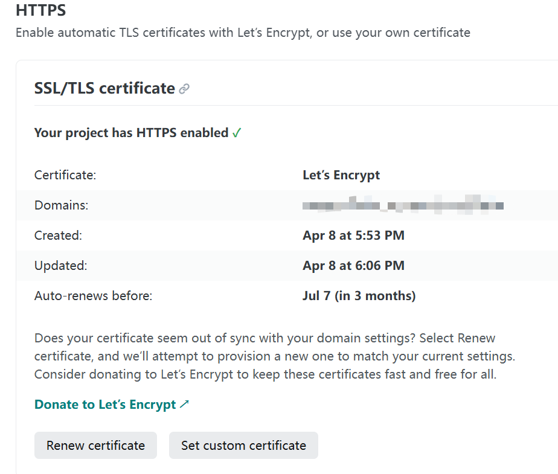

## 最后

等待一段时间，可以用浏览器输入博客域名地址，如果不挂梯子，能查看个人博客就配置成功了。
